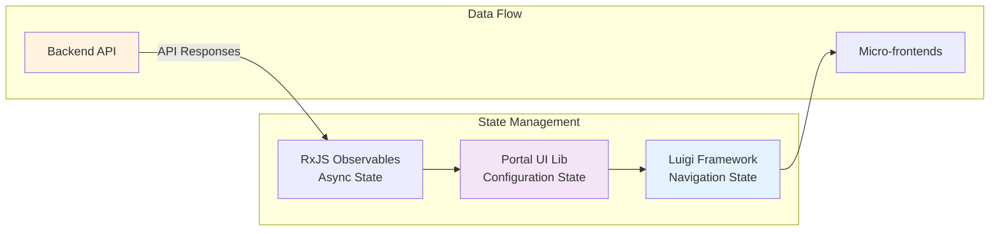
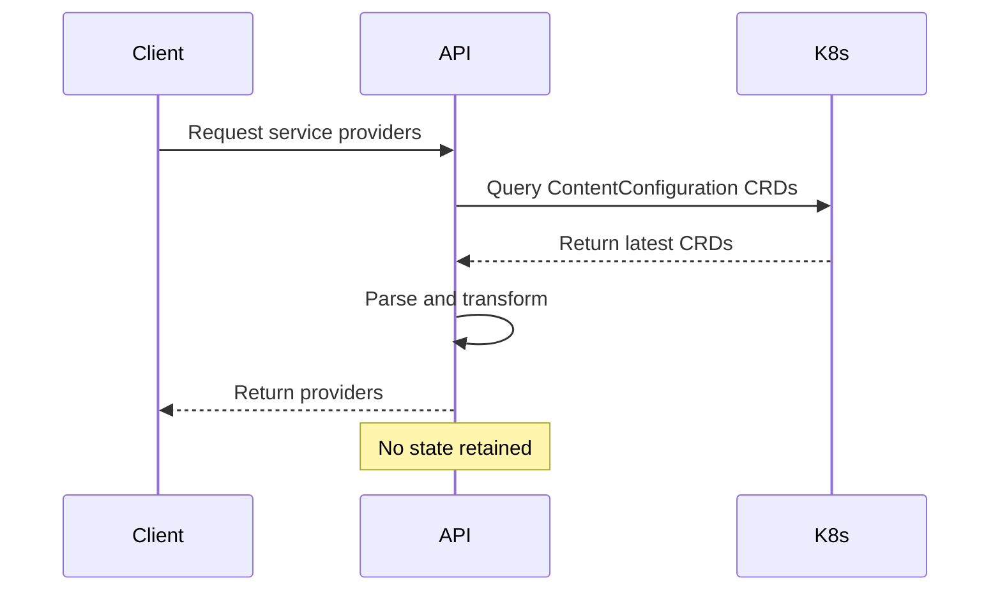
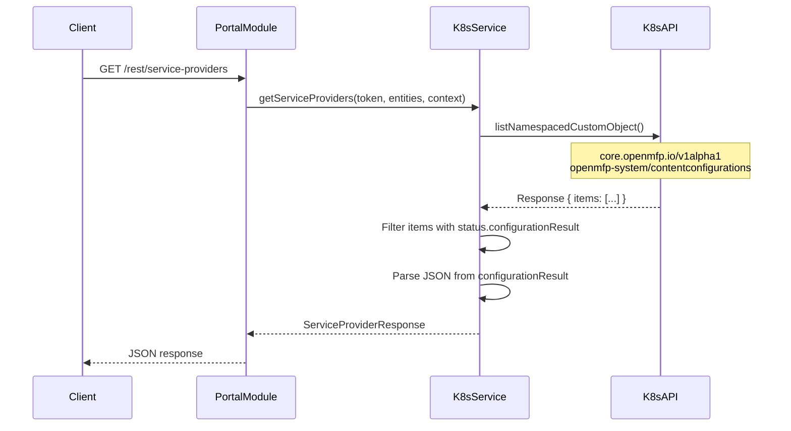
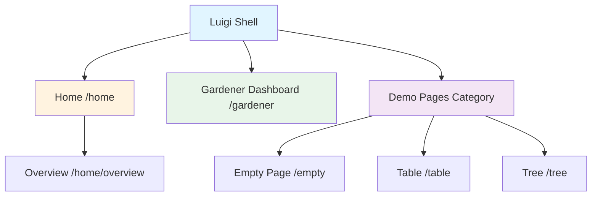
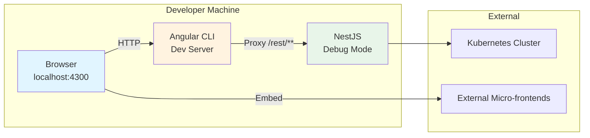
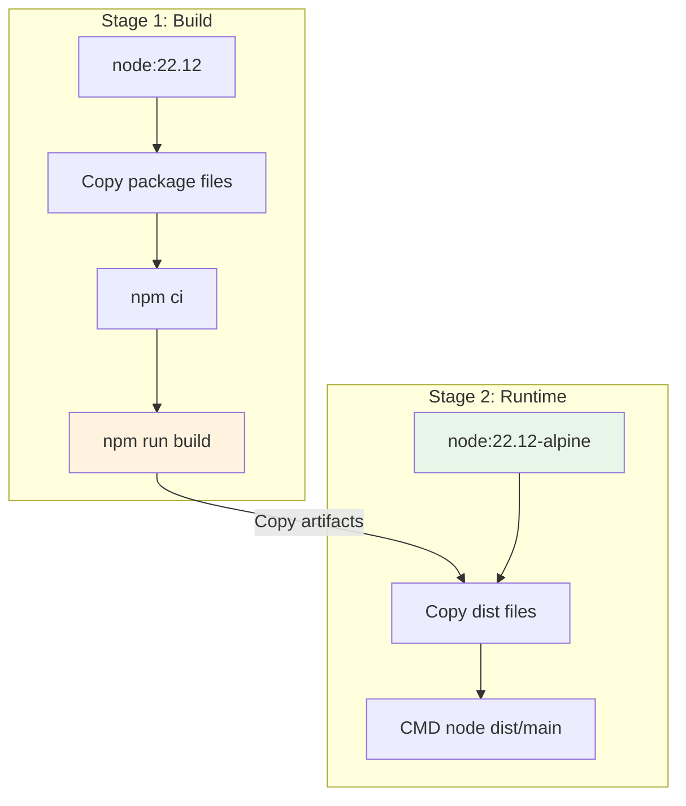

# Architecture & Code Documentation (ACD)

## Component Structure and Key Modules

### Frontend Structure

```
frontend/
├── src/
│   ├── app/
│   │   └── app.routes.ts          # Route configuration (empty - handled by Luigi)
│   ├── environments/
│   │   ├── environment.ts         # Development environment
│   │   └── environment.prod.ts    # Production environment
│   ├── main.ts                    # Application bootstrap
│   ├── index.html                 # HTML entry point
│   └── styles.scss                # Global styles
├── proxy.config.json              # Development proxy configuration
├── angular.json                   # Angular CLI configuration
└── package.json                   # Dependencies and scripts
```

#### Key Frontend Files

**main.ts**
```typescript
import { bootstrapApplication } from '@angular/platform-browser';
import {
  PortalComponent,
  PortalOptions,
  providePortal,
} from '@openmfp/portal-ui-lib';

const portalOptions: PortalOptions = {};

bootstrapApplication(PortalComponent, {
  providers: [providePortal(portalOptions)],
}).catch((err) => console.error(err));
```

The frontend is intentionally minimal. All portal functionality is provided by the `@openmfp/portal-ui-lib` external library, including:
- Luigi Framework integration
- Portal component rendering
- Navigation management
- Authentication flows

**app.routes.ts**
```typescript
import { Routes } from '@angular/router';

export const routes: Routes = [];
```

Routes are defined as an empty array because Luigi Framework handles all routing through its configuration system, not Angular Router.

**proxy.config.json**
```json
{
  "/rest/**": {
    "target": "http://localhost:3000",
    "secure": false,
    "logLevel": "debug",
    "changeOrigin": true
  }
}
```

Development proxy forwards all `/rest/**` requests from the Angular dev server (port 4300) to the NestJS backend (port 3000).

### Backend Structure

```
backend/
├── src/
│   ├── app.module.ts                           # Root application module
│   ├── main.ts                                 # NestJS bootstrap
│   ├── entity-context-provider/
│   │   └── account-entity-context-provider.service.ts
│   └── service-providers/
│       ├── kubernetes-service-providers.service.ts
│       ├── localServiceProviders.ts
│       ├── portal-context-provider.ts
│       └── provider-jsons/
│           └── service-providers.ts
├── test/
│   ├── app.e2e-spec.ts            # End-to-end tests
│   └── jest-e2e.json              # E2E test configuration
└── package.json                   # Dependencies and scripts
```

#### Key Backend Modules

**main.ts**
```typescript
import { NestFactory } from '@nestjs/core';
import { AppModule } from './app.module';

async function bootstrap() {
  const app = await NestFactory.create(AppModule);
  await app.listen(process.env.PORT || 3000);
}
bootstrap();
```

Standard NestJS bootstrap that creates the application and listens on port 3000 (or PORT environment variable).

**app.module.ts**
```typescript
import { Module } from '@nestjs/common';
import { PortalModule, PortalModuleOptions } from '@openmfp/portal-server-lib';
import { join } from 'path';
import { AccountEntityContextProvider } from './entity-context-provider/account-entity-context-provider.service';
import { KubernetesServiceProvidersService } from './service-providers/kubernetes-service-providers.service';
import { OpenmfpPortalProvider } from './service-providers/portal-context-provider';
import { config } from 'dotenv';

config({ path: './.env' });

const portalOptions: PortalModuleOptions = {
  frontendDistSources: join(__dirname, '../..', 'frontend/dist/frontend'),
  entityContextProviders: {
    account: AccountEntityContextProvider,
  },
  additionalProviders: [AccountEntityContextProvider],
  serviceProviderService: KubernetesServiceProvidersService,
  portalContextProvider: OpenmfpPortalProvider,
};

@Module({
  imports: [PortalModule.create(portalOptions)],
})
export class AppModule {}
```

**Configuration breakdown:**
- **frontendDistSources**: Path to built Angular application for static file serving
- **entityContextProviders**: Maps entity types to context providers (e.g., "account" → AccountEntityContextProvider)
- **additionalProviders**: Services to inject into NestJS dependency injection
- **serviceProviderService**: Implementation that fetches service provider configurations
- **portalContextProvider**: Provides global portal context (like API URLs)

## State Management Patterns

### Frontend State Management

The portal frontend does not implement custom state management. All state is managed by:

1. **Luigi Framework**: Maintains navigation state, current route, and micro-frontend lifecycle
2. **@openmfp/portal-ui-lib**: Manages portal configuration and user context
3. **RxJS**: Observable streams for asynchronous operations



### Backend State Management

The backend is stateless and does not maintain session state. Each request:
1. Receives authentication token
2. Queries Kubernetes for current ContentConfiguration CRDs
3. Returns fresh data
4. No caching implemented (consider adding for production)

**Service Provider State Flow:**



## API Integration

### REST API Endpoints

The portal backend exposes endpoints through the `@openmfp/portal-server-lib`:

**Base URL**: `/rest`

**Key endpoints provided by PortalModule:**
- `GET /rest/service-providers` - Fetch dynamic navigation and content configuration
- `GET /rest/entity-context` - Get entity-specific context and policies
- `GET /rest/portal-context` - Get global portal configuration

### Service Provider API

**KubernetesServiceProvidersService Implementation:**

```typescript
export class KubernetesServiceProvidersService implements ServiceProviderService {
  private k8sApi: CustomObjectsApi;

  constructor() {
    const kc = new k8s.KubeConfig();
    kc.loadFromDefault();
    this.k8sApi = kc.makeApiClient(k8s.CustomObjectsApi);
  }

  async getServiceProviders(
    token: string,
    entities: string[],
    context: Record<string, any>
  ): Promise<ServiceProviderResponse> {
    try {
      const response = await this.k8sApi.listNamespacedCustomObject(
        'core.openmfp.io',      // API Group
        'v1alpha1',             // Version
        'openmfp-system',       // Namespace
        'contentconfigurations' // Resource plural
      );

      if (!response.body['items']) {
        return { serviceProviders: [] };
      }

      const responseItems = response.body['items'] as any[];

      let contentConfigurations = responseItems
        .filter((item) => !!item.status.configurationResult)
        .map((item) =>
          JSON.parse(item.status.configurationResult) as ContentConfiguration
        );

      return {
        serviceProviders: [
          {
            contentConfiguration: contentConfigurations,
          } as RawServiceProvider,
        ],
      };
    } catch (error) {
      console.error(error);
    }
  }
}
```

**API Flow:**



### Entity Context API

**AccountEntityContextProvider Implementation:**

```typescript
@Injectable()
export class AccountEntityContextProvider implements EntityContextProvider {
  async getContextValues(
    token: string,
    context?: Record<string, any>
  ): Promise<Record<string, any>> {
    return {
      id: context.account,
      policies: [
        'create',
        'delete',
        'get',
        'list',
        'update',
        'watch',
        'gardener_project_create',
        'gardener_project_list',
        'gardener_shoot_create',
        'gardener_shoot_list',
      ],
    };
  }
}
```

**Returns:**
- **id**: The account identifier from the request context
- **policies**: Array of permission strings that control UI visibility and actions

### Portal Context API

**OpenmfpPortalProvider Implementation:**

```typescript
@Injectable()
export class OpenmfpPortalProvider implements PortalContextProvider {
  constructor() {}

  getContextValues(): Promise<Record<string, any>> {
    const context: Record<string, any> = {
      crdGatewayApiUrl: process.env.CRD_GATEWAY_API_URL,
    };
    return Promise.resolve(context);
  }
}
```

**Returns:**
- **crdGatewayApiUrl**: API endpoint for CRD Gateway service (from environment variable)

## Routing and Navigation

### Luigi Framework Navigation

All routing is handled by Luigi Framework through dynamic configuration loaded from Kubernetes CRDs.

**Navigation Structure:**



### Luigi Configuration Structure

**Node Configuration Example:**

```typescript
{
  entityType: 'global',          // Entity scope
  pathSegment: 'home',           // URL segment
  label: 'Overview',             // Display name
  icon: 'home',                  // SAP icon name
  hideFromNav: true,             // Hide from side navigation
  defineEntity: {
    id: 'example'                // Define entity context
  },
  viewUrl: '/home',              // Relative URL
  url: 'https://...',            // Absolute URL (for external micro-frontends)
  context: {                     // Data passed to micro-frontend
    title: 'Welcome',
    content: '...'
  },
  children: [...]                // Nested routes
}
```

### Navigation Types

**Internal Routes (viewUrl):**
```typescript
{
  pathSegment: 'overview',
  viewUrl: '/overview',
  label: 'Overview'
}
```
Served by the portal's own frontend application.

**External Micro-frontends (url):**
```typescript
{
  pathSegment: 'demo',
  url: 'https://fiddle.luigi-project.io/examples/...',
  label: 'Demo Page'
}
```
Loaded in iframe from external source.

**Virtual Trees (virtualTree):**
```typescript
{
  pathSegment: 'gardener',
  virtualTree: true,
  url: 'https://gardener-dashboard.example.com',
  label: 'Gardener Dashboard'
}
```
Embeds entire external application with its own routing.

### Entity-based Navigation

Navigation nodes can be scoped to entity types:

```typescript
{
  entityType: 'account',         // Only visible in account context
  pathSegment: 'resources',
  label: 'Resources'
}
```

The entity context is resolved by backend providers and passed to Luigi, which filters navigation based on current entity.

## Configuration Options

### Environment Variables

**Backend Configuration (.env):**

```bash
# Server Configuration
PORT=3000                          # Backend server port

# Kubernetes Configuration
KUBECONFIG=/path/to/kubeconfig     # Kubernetes config file (optional, defaults to ~/.kube/config)

# OpenMFP Configuration
CRD_GATEWAY_API_URL=https://...    # CRD Gateway API endpoint
```

**Frontend Configuration:**

Frontend configuration is minimal. The `environment.ts` and `environment.prod.ts` files only define the `production` flag:

```typescript
export const environment = {
  production: false  // or true for production
};
```

All runtime configuration comes from the backend via API endpoints.

### Portal Module Options

**PortalModuleOptions Interface:**

```typescript
interface PortalModuleOptions {
  // Path to built frontend assets
  frontendDistSources: string;

  // Map of entity types to context providers
  entityContextProviders: {
    [entityType: string]: Type<EntityContextProvider>;
  };

  // Additional services to inject
  additionalProviders: Provider[];

  // Service that fetches dynamic content
  serviceProviderService: Type<ServiceProviderService>;

  // Provider for global portal context
  portalContextProvider: Type<PortalContextProvider>;
}
```

**Example Configuration:**

```typescript
const portalOptions: PortalModuleOptions = {
  frontendDistSources: join(__dirname, '../..', 'frontend/dist/frontend'),
  entityContextProviders: {
    account: AccountEntityContextProvider,
    // Add more entity types as needed
  },
  additionalProviders: [AccountEntityContextProvider],
  serviceProviderService: KubernetesServiceProvidersService,
  portalContextProvider: OpenmfpPortalProvider,
};
```

### ContentConfiguration CRD Format

**CRD Structure:**

```yaml
apiVersion: core.openmfp.io/v1alpha1
kind: ContentConfiguration
metadata:
  name: my-content
  namespace: openmfp-system
  creationTimestamp: "2022-05-17T11:37:17Z"
status:
  configurationResult: |
    {
      "name": "my-content",
      "creationTimestamp": "2022-05-17T11:37:17Z",
      "luigiConfigFragment": {
        "data": {
          "nodes": [...],
          "nodeDefaults": {...}
        }
      }
    }
```

**Luigi Config Fragment Fields:**

- **nodes**: Array of navigation node configurations
- **nodeDefaults**: Default properties applied to all nodes
  - `entityType`: Default entity scope
  - `loadingIndicator`: Loading UI configuration
  - `icon`: Default icon

### Luigi Node Configuration

**Complete Node Example:**

```typescript
{
  // Navigation
  pathSegment: 'my-feature',          // URL segment
  label: 'My Feature',                // Display name
  icon: 'add',                        // SAP icon
  hideFromNav: false,                 // Show in navigation

  // Categorization
  category: {
    label: 'Feature Category',
    icon: 'group',
    collapsible: true
  },

  // Entity Context
  entityType: 'account',              // Entity scope
  defineEntity: {
    id: 'entity-id'
  },

  // Content Loading
  viewUrl: '/internal-path',          // Internal route
  url: 'https://external.com',        // External micro-frontend
  virtualTree: true,                  // Full app embedding

  // UI Behavior
  loadingIndicator: {
    enabled: true
  },

  // Data Passing
  context: {
    customData: 'value'
  },

  // Nested Navigation
  children: [...]
}
```

## Development Workflow

### Local Development Setup

**Prerequisites:**
- Node.js 22+
- npm 9+
- Access to Kubernetes cluster with ContentConfiguration CRDs
- Valid kubeconfig

**Setup Steps:**

```bash
# Install dependencies
npm run prepare                # Installs both frontend and backend

# Start development servers (runs concurrently)
npm start                      # Starts both frontend:4300 and backend:3000

# Or start individually
npm run start:ui              # Frontend only
npm run start:server          # Backend only
```

### Development Architecture



### Build and Test

**Build Commands:**

```bash
# Build both frontend and backend
npm run build

# Build individually
npm run build:ui              # Frontend production build
npm run build:server          # Backend compilation
```

**Test Commands:**

```bash
# Run all tests
npm test

# Run with coverage
npm run test:cov

# Test individually
npm run test:ui               # Frontend tests
npm run test:server           # Backend tests
```

**Lint Commands:**

```bash
# Lint all code
npm run lint

# Fix linting issues
npm run lint:fix
```

### Docker Build

**Local Docker Build:**

```bash
# Create secret file with GitHub token
mkdir -p .secret
echo -n $OPENMFP_GITHUB_TOKEN > .secret/gh-token

# Build with secrets
docker build --secret id=NODE_AUTH_TOKEN,src=.secret/gh-token .

# Cleanup secret on failure
docker build --secret id=NODE_AUTH_TOKEN,src=.secret/gh-token . || rm .secret/gh-token
```

**Build Stages:**



### Debugging

**Frontend Debugging:**
- Use Angular DevTools browser extension
- Chrome DevTools for debugging
- Source maps enabled in development

**Backend Debugging:**
```bash
npm run start:debug           # Starts with --debug flag
```
Attach debugger to `localhost:9229`

**VS Code Launch Configuration:**

```json
{
  "type": "node",
  "request": "attach",
  "name": "Attach to Backend",
  "port": 9229,
  "restart": true,
  "skipFiles": ["<node_internals>/**"]
}
```

## Testing Strategy

### Frontend Tests

**Test Framework:** Jest with Angular testing utilities

**Test File Pattern:** `*.spec.ts`

**Run Tests:**
```bash
cd frontend
npm test                      # Run tests
npm run test:cov             # Run with coverage
```

### Backend Tests

**Test Framework:** Jest with NestJS testing utilities

**Unit Tests:** `src/**/*.spec.ts`
**E2E Tests:** `test/**/*.e2e-spec.ts`

**Run Tests:**
```bash
cd backend
npm test                      # Unit tests
npm run test:e2e             # E2E tests
npm run test:cov             # Coverage
```

### Test Coverage

Both frontend and backend track test coverage in `./coverage` directories.

## Common Tasks

### Adding a New Entity Context Provider

1. Create provider service:
```typescript
import { Injectable } from '@nestjs/common';
import { EntityContextProvider } from '@openmfp/portal-server-lib';

@Injectable()
export class MyEntityContextProvider implements EntityContextProvider {
  async getContextValues(
    token: string,
    context?: Record<string, any>
  ): Promise<Record<string, any>> {
    return {
      id: context.myEntity,
      policies: ['read', 'write']
    };
  }
}
```

2. Register in `app.module.ts`:
```typescript
const portalOptions: PortalModuleOptions = {
  // ...
  entityContextProviders: {
    account: AccountEntityContextProvider,
    myEntity: MyEntityContextProvider,  // Add here
  },
  additionalProviders: [
    AccountEntityContextProvider,
    MyEntityContextProvider,            // Add here
  ],
  // ...
};
```

### Adding New ContentConfiguration

1. Create CRD in Kubernetes:
```bash
kubectl apply -f - <<EOF
apiVersion: core.openmfp.io/v1alpha1
kind: ContentConfiguration
metadata:
  name: my-new-content
  namespace: openmfp-system
spec:
  # Your spec here
EOF
```

2. Update status with configuration:
```bash
kubectl patch contentconfiguration my-new-content -n openmfp-system \
  --type=merge \
  --patch '{"status":{"configurationResult":"{...}"}}'
```

The portal will automatically pick up the new configuration on next API request.

### Customizing Service Provider Service

Replace `KubernetesServiceProvidersService` with custom implementation:

```typescript
export class CustomServiceProvidersService implements ServiceProviderService {
  async getServiceProviders(
    token: string,
    entities: string[],
    context: Record<string, any>
  ): Promise<ServiceProviderResponse> {
    // Custom logic - fetch from database, external API, etc.
    return {
      serviceProviders: [...]
    };
  }
}
```

Update `app.module.ts`:
```typescript
const portalOptions: PortalModuleOptions = {
  // ...
  serviceProviderService: CustomServiceProvidersService,
};
```

## Troubleshooting

### Frontend Not Loading

**Check:**
1. Backend is running on port 3000
2. Proxy configuration is correct
3. No CORS errors in browser console

### Backend Cannot Connect to Kubernetes

**Check:**
1. `KUBECONFIG` environment variable is set correctly
2. Kubeconfig file exists and has valid credentials
3. `openmfp-system` namespace exists
4. User/service account has permission to list ContentConfiguration CRDs

### No Navigation Items Appearing

**Check:**
1. ContentConfiguration CRDs exist in `openmfp-system`
2. CRDs have `status.configurationResult` populated
3. JSON in `configurationResult` is valid
4. Backend logs for errors fetching CRDs

### Micro-frontend Not Loading

**Check:**
1. External URL is accessible from browser
2. External service allows iframe embedding (X-Frame-Options)
3. CORS headers are set correctly on external service
4. Luigi node configuration has correct `url` field

## Performance Optimization

### Backend Optimization

**Caching ContentConfiguration:**
```typescript
@Injectable()
export class CachedServiceProvidersService implements ServiceProviderService {
  private cache: ServiceProviderResponse | null = null;
  private cacheTime = 60000; // 1 minute
  private lastFetch = 0;

  async getServiceProviders(
    token: string,
    entities: string[],
    context: Record<string, any>
  ): Promise<ServiceProviderResponse> {
    const now = Date.now();
    if (this.cache && (now - this.lastFetch) < this.cacheTime) {
      return this.cache;
    }

    // Fetch fresh data
    const result = await this.fetchFromKubernetes();
    this.cache = result;
    this.lastFetch = now;
    return result;
  }
}
```

**Watch for CRD Changes:**
```typescript
// Use Kubernetes watch API to invalidate cache
const watch = new k8s.Watch(kc);
watch.watch(
  '/apis/core.openmfp.io/v1alpha1/namespaces/openmfp-system/contentconfigurations',
  {},
  (type, obj) => {
    if (type === 'MODIFIED' || type === 'ADDED' || type === 'DELETED') {
      this.cache = null; // Invalidate cache
    }
  }
);
```

### Frontend Optimization

- Luigi handles lazy loading automatically
- Micro-frontends load only when navigated to
- Use `loadingIndicator` to show loading state

## Security Best Practices

### Environment Variables

- Never commit `.env` files with secrets
- Use Kubernetes secrets for production deployments
- Rotate credentials regularly

### API Security

- Always validate tokens on backend
- Implement rate limiting for production
- Use HTTPS in production
- Set appropriate CORS policies

### Kubernetes RBAC

Ensure service account has minimal required permissions:

```yaml
apiVersion: rbac.authorization.k8s.io/v1
kind: Role
metadata:
  name: portal-backend
  namespace: openmfp-system
rules:
  - apiGroups: ["core.openmfp.io"]
    resources: ["contentconfigurations"]
    verbs: ["get", "list", "watch"]
```

## External Library Documentation

- **NestJS**: https://docs.nestjs.com
- **Angular**: https://angular.io/docs
- **Luigi Framework**: https://docs.luigi-project.io
- **Kubernetes Client**: https://github.com/kubernetes-client/javascript
- **@openmfp/portal-ui-lib**: Internal OpenMFP library
- **@openmfp/portal-server-lib**: Internal OpenMFP library
