# Architecture

## Overview

The OpenMFP Portal is a web-based management interface for the OpenMFP platform. It provides a unified interface for accessing and managing various OpenMFP resources, services, and integrations through a micro-frontend architecture powered by Luigi Framework.

### Purpose

The portal serves as the central entry point for users to:
- Access and manage OpenMFP resources
- Navigate between different micro-frontends and services
- Interact with Kubernetes custom resources through a user-friendly interface
- Integrate with external services like Gardener Dashboard

### Technology Stack

**Frontend:**
- Angular 18 with standalone components
- Luigi Framework for micro-frontend orchestration
- @openmfp/portal-ui-lib for UI components
- TypeScript 5.5

**Backend:**
- NestJS 10 framework
- @openmfp/portal-server-lib for portal services
- Kubernetes client-node for CRD interaction
- Node.js 22+

## High-Level Architecture


## Component Architecture

### Frontend Architecture

```mermaid
graph LR
    subgraph "Frontend Application"
        Main[main.ts<br/>Bootstrap]
        Portal[PortalComponent<br/>from portal-ui-lib]
        Luigi[Luigi Framework<br/>Micro-frontend Shell]
        Config[Portal Configuration]
    end

    subgraph "External Libraries"
        PUIL[@openmfp/portal-ui-lib]
        LuigiCore[@luigi-project/core]
        OAuth[@luigi-project/plugin-auth-oauth2]
    end

    Main -->|bootstrapApplication| Portal
    Main -->|providePortal| Config
    Portal --> Luigi
    Portal --> PUIL
    Luigi --> LuigiCore
    Luigi --> OAuth

    style Main fill:#e3f2fd
    style Portal fill:#f3e5f5
    style Luigi fill:#fff3e0
```

The frontend is minimal by design, delegating most functionality to the `@openmfp/portal-ui-lib` library. This library provides:
- The main `PortalComponent` that serves as the Luigi shell
- Navigation configuration
- Micro-frontend integration
- Authentication handling

### Backend Architecture

```mermaid
graph TB
    subgraph "NestJS Application"
        Main[main.ts<br/>Bootstrap]
        AppModule[AppModule]
        PortalModule[PortalModule<br/>from portal-server-lib]

        subgraph "Custom Providers"
            SPService[KubernetesServiceProvidersService]
            EntityProvider[AccountEntityContextProvider]
            ContextProvider[OpenmfpPortalProvider]
        end
    end

    subgraph "Kubernetes Integration"
        K8sClient[Kubernetes Client<br/>@kubernetes/client-node]
        CustomAPI[CustomObjectsApi]
    end

    subgraph "Portal Server Library"
        PSL[@openmfp/portal-server-lib]
        Interfaces[ServiceProviderService<br/>EntityContextProvider<br/>PortalContextProvider]
    end

    Main --> AppModule
    AppModule -->|imports| PortalModule
    AppModule -->|configures| SPService
    AppModule -->|configures| EntityProvider
    AppModule -->|configures| ContextProvider

    SPService -->|implements| Interfaces
    EntityProvider -->|implements| Interfaces
    ContextProvider -->|implements| Interfaces

    SPService --> K8sClient
    K8sClient --> CustomAPI

    PortalModule --> PSL

    style Main fill:#e8f5e9
    style AppModule fill:#fff3e0
    style SPService fill:#e1f5ff
    style K8sClient fill:#f3e5f5
```

## Key Workflows

### Service Provider Discovery Flow


### Entity Context Resolution Flow


### Content Configuration Loading


## Dependencies and Integrations

### Frontend Dependencies

**Core Framework:**
- **@angular/core (^18.0.0)**: Primary application framework
- **@angular/router (^18.0.0)**: Routing capabilities
- **rxjs (~7.8.0)**: Reactive programming library

**Portal Libraries:**
- **@openmfp/portal-ui-lib (^0.82.0)**: OpenMFP portal UI components and Luigi shell
- **@luigi-project/core (^2.18.1)**: Micro-frontend framework for navigation and composition
- **@luigi-project/plugin-auth-oauth2 (^2.18.1)**: OAuth2 authentication plugin

**Utilities:**
- **jwt-decode (^4.0.0)**: JWT token parsing
- **jmespath (0.16.0)**: JSON query language
- **lodash (4.17.21)**: JavaScript utility library

### Backend Dependencies

**Core Framework:**
- **@nestjs/core (^10.4.6)**: NestJS application framework
- **@nestjs/common (^10.4.6)**: Common NestJS utilities
- **@nestjs/platform-express (^10.4.6)**: Express platform adapter

**Portal Libraries:**
- **@openmfp/portal-server-lib (^0.93.0)**: OpenMFP portal server components and services

**Kubernetes Integration:**
- **@kubernetes/client-node (^0.22.0)**: Official Kubernetes client for Node.js
  - Used to interact with Kubernetes API
  - Reads ContentConfiguration custom resources
  - Loads kubeconfig from default locations

**HTTP and Utilities:**
- **@nestjs/axios (^3.0.1)**: HTTP client module
- **axios (^1.6.3)**: Promise-based HTTP client
- **cookie-parser (1.4.7)**: Cookie parsing middleware
- **dotenv (^16.4.5)**: Environment variable management

### External Service Integrations

**Gardener Dashboard:**
- Integrated as a virtual tree node in Luigi navigation
- Accessed via iframe embedding
- URL configured in ContentConfiguration CRDs
- Example: `https://d.ing.gardener-op.mfp-dev.shoot.canary.k8s-hana.ondemand.com`

**Luigi Fiddle Examples:**
- Demo micro-frontends for testing
- Hosted at `https://fiddle.luigi-project.io`
- Include table, tree, and empty page examples

### Kubernetes Custom Resources

**ContentConfiguration CRD:**
- **API Group**: `core.openmfp.io`
- **Version**: `v1alpha1`
- **Namespace**: `openmfp-system`
- **Purpose**: Dynamic configuration of portal content and navigation

**CRD Structure:**
```yaml
apiVersion: core.openmfp.io/v1alpha1
kind: ContentConfiguration
metadata:
  name: example-config
  namespace: openmfp-system
spec:
  # Specification details
status:
  configurationResult: |
    {
      "name": "example",
      "creationTimestamp": "2022-05-17T11:37:17Z",
      "luigiConfigFragment": {
        "data": {
          "nodes": [...]
        }
      }
    }
```

### Configuration Flow


## Deployment Architecture

### Development Environment

```mermaid
graph TB
    subgraph "Development Machine"
        FE[Angular Dev Server<br/>Port 4300]
        BE[NestJS Dev Server<br/>Port 3000]
        Proxy[Proxy Config<br/>/rest/** → :3000]
    end

    subgraph "Kubernetes Cluster"
        K8s[Kubernetes API<br/>via kubeconfig]
        NS[openmfp-system namespace]
    end

    FE -->|Proxied requests| Proxy
    Proxy --> BE
    BE --> K8s
    K8s --> NS

    style FE fill:#e3f2fd
    style BE fill:#fff3e0
    style K8s fill:#e8f5e9
```



**Development Setup:**
- Frontend runs on port 4300 with hot reload
- Backend runs on port 3000 with debug mode
- Proxy configuration forwards `/rest/**` from frontend to backend
- Backend connects to Kubernetes using default kubeconfig

### Production Deployment


**Production Deployment:**
- Multi-stage Docker build
- Frontend built to static assets in `frontend/dist`
- Backend built to JavaScript in `backend/dist`
- Single Node.js process serves both static frontend and API
- Alpine-based runtime image for minimal size
- Exposed on port 3000

### Docker Build Process


## Security Considerations

### Authentication

- OAuth2 authentication via Luigi plugin (`@luigi-project/plugin-auth-oauth2`)
- JWT token handling via `jwt-decode`
- Tokens passed to backend for service provider requests
- Entity context resolution based on authenticated user

### Authorization

The `AccountEntityContextProvider` defines policies for authenticated users:
- **Resource operations**: create, delete, get, list, update, watch
- **Gardener operations**: gardener_project_create, gardener_project_list, gardener_shoot_create, gardener_shoot_list

### Kubernetes Access

- Backend uses Kubernetes client with kubeconfig authentication
- Reads ContentConfiguration CRDs from `openmfp-system` namespace
- Service account or user credentials loaded from default kubeconfig location
- No direct client-to-Kubernetes communication (all proxied through backend)

## Extensibility

### Adding New Content

New portal content can be added dynamically by creating ContentConfiguration CRDs in Kubernetes:

```yaml
apiVersion: core.openmfp.io/v1alpha1
kind: ContentConfiguration
metadata:
  name: my-new-content
  namespace: openmfp-system
status:
  configurationResult: |
    {
      "name": "my-new-content",
      "luigiConfigFragment": {
        "data": {
          "nodes": [
            {
              "pathSegment": "my-feature",
              "label": "My Feature",
              "icon": "add",
              "url": "https://my-micro-frontend.example.com",
              "entityType": "account"
            }
          ]
        }
      }
    }
```

### Custom Entity Context Providers

Additional entity types can be supported by implementing the `EntityContextProvider` interface and registering in `AppModule`:

```typescript
export class CustomEntityContextProvider implements EntityContextProvider {
  async getContextValues(
    token: string,
    context?: Record<string, any>
  ): Promise<Record<string, any>> {
    // Custom logic
    return {
      id: context.entityId,
      customData: {}
    };
  }
}
```

### Service Provider Customization

The `KubernetesServiceProvidersService` can be replaced or extended to fetch configurations from different sources (databases, external APIs, etc.) by implementing the `ServiceProviderService` interface.

## Performance Considerations

### Micro-frontend Loading

- Luigi Framework handles lazy loading of micro-frontends
- Only active routes load their corresponding micro-frontends
- Virtual trees (like Gardener) load external applications in isolated iframes

### Backend Caching

- ContentConfiguration CRDs are fetched on each request
- Consider implementing caching for production deployments
- Watch Kubernetes events for cache invalidation

### Build Optimization

- Production builds use Angular's optimization
- Tree-shaking removes unused code
- Multi-stage Docker build separates build and runtime dependencies
- Alpine Linux runtime image minimizes container size

## Monitoring and Observability

### Logging

- Backend uses NestJS built-in logging
- Errors logged to console with stack traces
- Frontend errors logged to browser console

### Health Checks

- Backend exposes health endpoints via NestJS
- Kubernetes readiness/liveness probes can be configured
- Frontend availability depends on backend serving static assets

## Related Repositories

- **@openmfp/portal-ui-lib**: Core portal UI components and Luigi configuration
- **@openmfp/portal-server-lib**: Backend portal services and interfaces
- **luigi-project/luigi**: Micro-frontend framework
- **kubernetes/client-node**: Official Kubernetes client for Node.js
